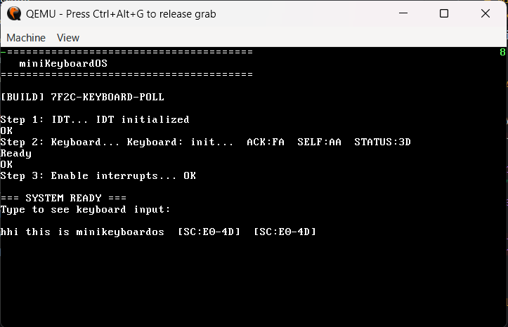

# miniKeyboardOS

Minimal x86 32-bit kernel that boots via GRUB (Multiboot v1) and prints keyboard input to the VGA text console. Built for learning, debugging, and rapid iteration.


## Highlights

- Multiboot v1 header (`0x1BADB002`) and GRUB ISO boot
- Correct PIC remap + IDT entries (IRQ0: timer, IRQ1: keyboard)
- PS/2 keyboard driver with ASCII mapping, Shift/Caps, and extended `E0` scancodes
- Clean VGA text output with a tiny heartbeat spinner
- Interrupt-first input, polling fallback guarded to avoid duplicates

## Quick Start (Windows + WSL)

This project builds the kernel on Windows and the GRUB ISO in WSL.

1. Install tools in WSL (Ubuntu):

```bash
sudo apt update
sudo apt install -y make grub-pc-bin xorriso mtools
```

2. Build the kernel (PowerShell, Windows):

```powershell
cd "d:\PROJECTS __ DEV\minikeyboardos"
make all
```

3. Build the ISO (run from PowerShell via WSL):

```powershell
wsl -e bash -c "cd '/mnt/d/PROJECTS __ DEV/minikeyboardos' ; make iso"
```

4. Run in QEMU (Windows):

```powershell
cd "d:\PROJECTS __ DEV\minikeyboardos"
qemu-system-i386 -cdrom miniKeyboardOS.iso -m 256M -display gtk -serial stdio
```

Zero-error sequence (copy-paste as one block):

```powershell
cd "d:\PROJECTS __ DEV\minikeyboardos"
make all
wsl -e bash -c "cd '/mnt/d/PROJECTS __ DEV/minikeyboardos' ; make iso"
qemu-system-i386 -cdrom miniKeyboardOS.iso -m 256M -display gtk -serial stdio
```

Expected output shows boot steps, then “Type to see keyboard input:”. Letters print as characters; arrows and other non-printables show `[SC:E0-xx]` or `[SC:xx]`. A small spinner appears at the top-left; the top-right digit increments on each keyboard interrupt.

## Make Targets

- `all` — build `kernel.elf` and `kernel.bin`
- `iso` — produce `miniKeyboardOS.iso` with GRUB + kernel
- `run-iso` — build and run QEMU with the ISO

Example:

```powershell
make all
wsl -e bash -c "cd '/mnt/d/PROJECTS __ DEV/minikeyboardos' ; make iso"
qemu-system-i386 -cdrom miniKeyboardOS.iso -m 256M -display gtk -serial stdio
```

## Project Layout

- `boot/boot.asm` — Multiboot header + minimal entry, sets GDT and jumps to `kernel_main`
- `kernel/kernel.cpp` — main; initializes VGA/IDT/keyboard; spinner; polling fallback
- `kernel/idt.cpp` — IDT and PIC remap (IRQs 0–15 → vectors 32–47)
- `kernel/isr.asm` — ISR stubs for timer and keyboard
- `kernel/keyboard.cpp` — PS/2 controller + device init, ISR, ASCII mapping, Shift/Caps, E0 extended keys
- `drivers/vga.cpp` — VGA text mode (80×25) helpers: clear, print, putchar
- `linker.ld` — places `.multiboot` at start and kernel at 1MB
- `Makefile` — Windows build + WSL ISO targets

## Screenshots



## Architecture & Flow

1. GRUB loads the kernel (Multiboot v1) and jumps to `_start` in `boot/boot.asm`.
2. Boot code sets up GDT and enters protected mode, then calls `kernel_main()`.
3. Kernel initializes VGA, sets up IDT, remaps PIC, and initializes the PS/2 keyboard.
4. `sti` enables interrupts. `keyboard_isr()` handles keypresses; non-printables log as hex tags.
5. Main loop shows a heartbeat spinner. Polling exists as a fallback and is disabled after first IRQ to avoid double prints.

## Troubleshooting

- "no multiboot header found"

  - Ensure GRUB uses `multiboot /boot/kernel.elf` (not `multiboot2`).
  - Confirm the Multiboot magic is `0x1BADB002` and the header is in the first 8KB.
  - Rebuild ISO; if needed, delete `iso/boot/grub/grub.cfg` and run `make iso` again.

- `make: command not found` (WSL)

  - Install tools: `sudo apt install -y make grub-pc-bin xorriso mtools`.

- QEMU: "Could not open 'miniKeyboardOS.iso'"

  - Run `make iso` in WSL first; verify the ISO file exists in the project root.
  - If you ran `make distclean`, rebuild: `make all` then `make iso` (via WSL) before launching QEMU.

- No input shown in QEMU

  - Check that `sti` runs and PIC unmasked IRQ1.
  - Watch the top-right digit; it increments per keyboard ISR. If it doesn’t, interrupts aren’t firing.
  - As a fallback, enable polling in the main loop (`keyboard_poll()`), then address IRQ setup.

- Double character prints
  - Polling can race with the ISR. This repo guards polling (disabled after first IRQ) to avoid duplicates.

## Development Notes

- ASCII mapping lives in `kernel/keyboard.cpp` (`SCANCODE_MAP`). Extend it as needed.
- Extended keys: an `0xE0` prefix is handled; non-printables log as `[SC:E0-xx]`.
- Modifiers: `Shift` and `CapsLock` are tracked; letters become uppercase when `(Shift XOR CapsLock)`.
- VGA writes are 16-bit cells at 0xB8000: high byte is attribute, low byte is character.

## Known Warnings

- Linker may warn: "LOAD segment with RWX permissions" — acceptable for this educational kernel, but you can split segments (RO/RW) later.

## After Cleaning

If you ran `make distclean`, the ISO and build outputs are removed. Rebuild in this exact order to avoid errors:

```powershell
cd "d:\PROJECTS __ DEV\minikeyboardos"
make all
wsl -e bash -c "cd '/mnt/d/PROJECTS __ DEV/minikeyboardos' ; make iso"
qemu-system-i386 -cdrom miniKeyboardOS.iso -m 256M -display gtk -serial stdio
```

## Future Enhancements

- **Shift symbol map** — full Shift+key support for `!@#$%^&*()_+{}:|<>?` etc.
- **Scan code set 2 support** — translate Set 2 scancodes from modern keyboards
- **Memory manager** — physical frame allocator using Multiboot memory map
- **Paging** — set up page tables and enable virtual memory (CR0.PG)
- **Basic shell** — command buffer, parse and execute simple commands
- **System calls** — ring 3 user mode + `int 0x80` interface

## License

This project is for learning and experimentation. Use at your own risk.
